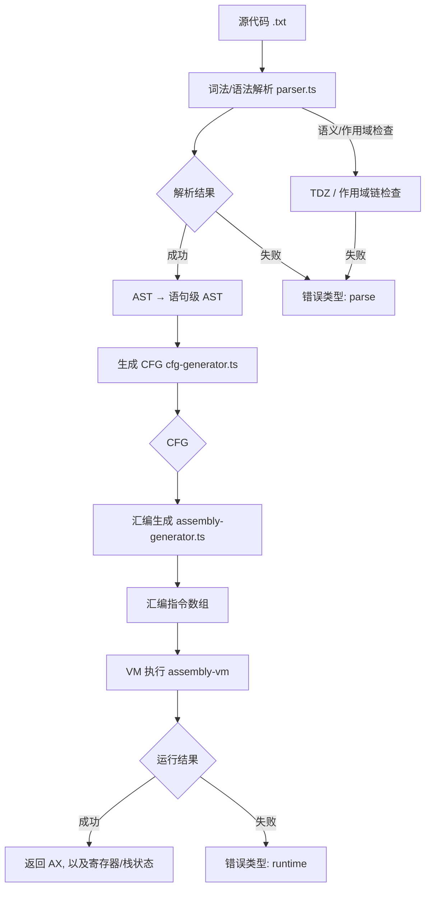

## 编译与执行总体流程

## 解析阶段（parser.ts）
- 建立词法作用域链：
  - `parseBlockStatement` 遇到 `{}` 新建 `Scope`，离开块恢复父作用域。
  - `parseForStatement` 为整个 for 创建独立作用域；init 可为 `let`/`int`/赋值/空；条件与 update 均允许访问 for 作用域中的变量；for 结束后恢复到父作用域。
- 标识符解析：
  - `parseIdentifier` 先沿作用域链查找变量，不存在则记录编译错误 “Variable 'x' is not defined”。
  - TDZ 检查：不允许在声明前读取 `let`；for 的特例允许条件/体内访问 init 中的 `let`。

## CFG 生成（cfg-generator.ts）
- 基本策略：
  - 按顺序将简单语句聚合进当前基本块；遇到控制流（if/while/for/return/break/continue）拆分成新的块并连边；控制流后另起新块承接后续语句。
  - for 结构拆分为 init → 条件头 → 体 → update → 回到条件头，false 分支出环。
- 备注：基本块是控制流单元，并非词法作用域。词法作用域由 AST 的 BlockStatement/For 语句负责。

## 汇编生成（assembly-generator.ts）

我们拿这个做例子
int checkGrade() {
    let grade = 0;
    let score = 70;
    {
      let i = 0;
      score = score + 1;
    }
    
    if (score >= 90) {
        grade = 1;  // A级
        let bonusA = 10;
        {
          grade = 10;
        }
        grade = 111;
    } else if (score >= 80) {
      let bonusB = 5;
      grade = 2;
      let grade = 2;  // B级
      {
        grade = grade + 20;
        let c = 100;
      }
      let cc = 1110;
      cc = 222;
    } else if (score >= 60) {
      grade = 3; // C 级
    }
    let k = 9990;

    if (k) {
      let jj = 111;
      {
        let j = 1111;
        if (j) {
          j = 222;

        }
        let j11= 1231;
        {
          let xx = 1;
        }
      }
      let j111 = 123123;
    }
    return grade;
}

📋 控制流图 (CFG):
基本块: checkGrade_entry_block
  [入口块]
  语句:
    - 声明let变量 grade
    - 声明let变量 score
    - 代码块 
      {
          - 声明let变量 i
          - 赋值 score = 变量: score + 数字: 1
      }
  前驱块: 无
  后继块: checkGrade_block_2

基本块: checkGrade_block_2
  语句:
    - 变量: score >= 数字: 90
  前驱块: checkGrade_entry_block
  后继块: checkGrade_block_3, checkGrade_block_5

基本块: checkGrade_block_3
  语句:
    - 赋值 grade = 数字: 1
    - 声明let变量 bonusA
    - 代码块 
      {
          - 赋值 grade = 数字: 10
      }
    - 赋值 grade = 数字: 111
  前驱块: checkGrade_block_2
  后继块: checkGrade_block_13

基本块: checkGrade_block_5
  语句:
    - 变量: score >= 数字: 80
  前驱块: checkGrade_block_2
  后继块: checkGrade_block_6, checkGrade_block_8

基本块: checkGrade_block_13
  语句:
    - 声明let变量 k
  前驱块: checkGrade_block_3, checkGrade_block_6, checkGrade_block_9, checkGrade_block_8
  后继块: checkGrade_block_14

基本块: checkGrade_block_6
  语句:
    - 声明let变量 bonusB
    - 赋值 grade = 数字: 2
    - 声明let变量 grade
    - 代码块 
      {
          - 赋值 grade = 变量: grade + 数字: 20
          - 声明let变量 c
      }
    - 声明let变量 cc
    - 赋值 cc = 数字: 222
  前驱块: checkGrade_block_5
  后继块: checkGrade_block_13

基本块: checkGrade_block_14
  语句:
    - 变量: k
  前驱块: checkGrade_block_13
  后继块: checkGrade_block_15, checkGrade_block_18

基本块: checkGrade_block_8
  语句:
    - 变量: score >= 数字: 60
  前驱块: checkGrade_block_5
  后继块: checkGrade_block_9, checkGrade_block_13

基本块: checkGrade_block_15
  语句:
    - 声明let变量 jj
    - 代码块 
      {
          - 声明let变量 j
          - If条件: 变量: j
          - 声明let变量 j11
          - 代码块 
      {
          - 声明let变量 xx
      }
      }
    - 声明let变量 j111
  前驱块: checkGrade_block_14
  后继块: checkGrade_block_18

基本块: checkGrade_block_9
  语句:
    - 赋值 grade = 数字: 3
  前驱块: checkGrade_block_8
  后继块: checkGrade_block_13

基本块: checkGrade_block_18
  语句:
    - 返回语句
  前驱块: checkGrade_block_15, checkGrade_block_14
  后继块: checkGrade_block_1

基本块: checkGrade_block_1
  [出口块]
  语句:
    - (空)
  前驱块: checkGrade_block_18
  后继块: 无

控制流边:
  checkGrade_entry_block → checkGrade_block_2
  checkGrade_block_2 → checkGrade_block_3
  checkGrade_block_2 → checkGrade_block_5
  checkGrade_block_3 → checkGrade_block_13
  checkGrade_block_5 → checkGrade_block_6
  checkGrade_block_5 → checkGrade_block_8
  checkGrade_block_13 → checkGrade_block_14
  checkGrade_block_6 → checkGrade_block_13
  checkGrade_block_14 → checkGrade_block_15
  checkGrade_block_14 → checkGrade_block_18
  checkGrade_block_8 → checkGrade_block_9
  checkGrade_block_8 → checkGrade_block_13
  checkGrade_block_15 → checkGrade_block_18
  checkGrade_block_9 → checkGrade_block_13
  checkGrade_block_18 → checkGrade_block_1

### 入口块（函数级变量）
- 统计入口块中最外层声明（函数级），一次性分配栈空间：`sub esp, N`。
- 对这些变量生成初始化指令，偏移从 `-1` 开始递减。

### 非入口块的“最外层声明”统一分配
- 对每个非入口基本块：
  - 先根据当前的作用域 
  - 先收集该块“最外层”的声明条目数（不含内层 `{}` 块）。
  - 一次性分配：`sub esp, blockVarCount`，进入对应的块作用域；
  - 块末释放：`add esp, blockVarCount`；
  - 特例：for 初始化块保留其分配，直至循环结束（不在该块末释放）。

### 词法块 `{}`
- 对 `BlockStatement`：
  - 统计块内直接声明数，进入作用域并 `sub esp, count`；
  - 生成块内语句；
  - 块末 `add esp, count` 并退出作用域。

### 偏移计算（ScopeManager）
- 函数级变量：从 `-1` 递减（相对 `bp`）。
- 块级变量：
  - 进入块时已知该块将分配的总数 `blockVarCount`；
  - 计算公式（概念）：`offset = -(函数级变量已分配数 + 外层累计块分配 + 当前块已声明数 + 1)`。

### 条件跳转与标志位
- 比较：`cmp eax, ebx` 设置 VM 的 greater/equal/less 三标志。
- 跳转：`jg/jge/jl/jle/je/jne` 直接依据标志，不再插入 `setxx`/`and eax, 1`。

### 赋值/表达式
- 赋值表达式（例如 for 的 `i = i + 1`）在二元表达式生成中处理：先生成右值，再 `si <offset>` 存回。

### 返回与清理
- 显式/隐式 return：
  - 根据返回值生成 `mov/计算` 或 `li <offset>`。
  - 释放：`add esp, (函数级变量数 + 所有仍未释放的块级总和)`。
  - 清理寄存器：`mov ebx, 0`。
  - `ret`。

## VM 运行（vm-runner.ts）
- 运行前：区分错误类型：parse / compile / runtime。
- 运行后：输出 AX、BX、SP、BP，验证栈与寄存器恢复。

## 校验要点 Checklist
- 作用域：
  - for 有独立作用域；init 变量仅在 for 内有效；空 init 支持；for 外访问 init 变量报错。
  - `let` 块级作用域仅在 `{}` 内有效；同名遮蔽正确；离开块立即释放。
- 栈与偏移：
  - 入口块函数级一次性分配；
  - 非入口块“最外层声明”统一分配；内层 `{}` 再次分配；
  - 偏移与预期一致（例如示例中 `c` 为 `-6`）。
- 跳转/标志：无多余 `setxx/and`；依据标志直接跳转。
- 返回：`ebx` 归零；栈完全恢复（SP 回到 1023）。

## 每个基本块的分析与栈分配（基于上例 CFG 与汇编）

以下结合实际生成的 CFG 与汇编，逐块说明变量、分配、偏移与控制流。

说明：下面每一步都会展示“作用域栈（从外到内）”，以及“当前作用域”。
作用域栈示例：
- 作用域栈: [FunctionScope, Block#1, Block#2]
- 当前作用域: Block#2

逐语句展示规则（BasicBlock 内）：
- 在每条语句前给出“进入该语句前”的作用域栈和当前作用域；
- 语句若为 `{}`（BlockStatement），进入时 push 新作用域，离开时 pop；
- BasicBlock 结束处，给出“块结束”的作用域栈与当前作用域（应与进入时一致，除 for-init 特例）。
同时为每一步展示“已分配空间长度”：
- 形式：已分配(函数级/块级累计/总计) = a/b/(a+b)
- 函数级为入口块一次性或后续动态分配的总槽位数；块级累计为当前活跃的块作用域总槽位（含嵌套）。

1) `checkGrade_entry_block`
- 最外层（函数级）声明：`grade`, `score`。
- 分配：`sub esp, 2`（函数级）
- 偏移：`score → -1`，`grade → -2`
- 若入口块内包含词法块（例如 `{ let i = 0; score = score + 1; }`）：
  - 这是一个独立的 `BlockStatement`，进入该词法块时统计最外层声明数：此处为 `i` 共 1 个 → `sub esp, 1`
  - 块内偏移临时变化：`i → -3`（在函数级 2 个基础上新增 1），对 `score` 的读写仍为 `-1`
  - 词法块结束时释放：`add esp, 1`
- 后继：`checkGrade_block_2`

作用域：
- 作用域栈: [FunctionScope]
- 当前作用域: FunctionScope（若进入入口内的 `{}`，则为 [FunctionScope, Block@entry]，当前为 Block@entry）

分配长度：
- 进入函数：+2（函数级）
- 入口内词法块：+1（进入）/-1（退出）

逐语句（示例：包含入口内词法块）
1. `let grade = 0;`
   - 作用域栈: [FunctionScope]
   - 当前作用域: FunctionScope
   - 已分配(函数级/块级累计/总计) = 2/0/2
2. `let score = 70;`
   - 作用域栈: [FunctionScope]
   - 当前作用域: FunctionScope
   - 已分配(函数级/块级累计/总计) = 2/0/2
3. `{ let i = 0; score = score + 1; }`
   - 进入 `{}` 前：
     - 作用域栈: [FunctionScope]
     - 当前作用域: FunctionScope
     - 已分配(函数级/块级累计/总计) = 2/0/2
   - 进入 `{}` 后的首条语句 `let i = 0;`：
     - 作用域栈: [FunctionScope, Block@entry]
     - 当前作用域: Block@entry
     - 已分配(函数级/块级累计/总计) = 2/1/3
   - 下一条语句 `score = score + 1;`：
     - 作用域栈: [FunctionScope, Block@entry]
     - 当前作用域: Block@entry
     - 已分配(函数级/块级累计/总计) = 2/1/3
   - 离开 `{}`：
     - 作用域栈回到: [FunctionScope]
     - 当前作用域: FunctionScope
     - 已分配(函数级/块级累计/总计) = 2/0/2

块结束：
- 作用域栈: [FunctionScope]
- 当前作用域: FunctionScope
- 已分配(函数级/块级累计/总计) = 2/0/2

2) `checkGrade_block_2`（条件：`score >= 90`）
- 语义：生成条件计算与比较；不进行变量分配。
- True → `checkGrade_block_3`；False → `checkGrade_block_5`

作用域：
- 作用域栈: [FunctionScope]
- 当前作用域: FunctionScope

分配长度：无新增/释放

块结束：
- 作用域栈: [FunctionScope]
- 当前作用域: FunctionScope
- 已分配(函数级/块级累计/总计) = 2/0/2
3) `checkGrade_block_3`（then 分支）
- 语句：`grade = 1; let bonusA = 10; { grade = 10; } grade = 111;`
- 分配策略：
  - 该块最外层新增声明：`bonusA`（统一按块级一次性分配 1）
  - 汇编：`sub esp, 1`（函数级/块级注释以最终实现为准）
- 偏移：`bonusA → -3`（在已有函数级 2 个基础上新增 1）
- 块内 `{}` 为独立词法块，无新增声明，仅赋值，不再额外分配。
- 结束：释放该块最外层分配（`add esp, 1`）
- 后继：`checkGrade_block_13`

作用域：
- 作用域栈: [FunctionScope, Block#then]
- 当前作用域: Block#then（进入内部 `{}` 时为 [FunctionScope, Block#then, Block#inner]）

分配长度：
- 进入 then：+1（最外层声明 bonusA）
- 退出 then：-1

逐语句
1. `grade = 1;`
   - 作用域栈: [FunctionScope, Block#then]
   - 当前作用域: Block#then
   - 已分配(函数级/块级累计/总计) = 2/1/3
2. `let bonusA = 10;`
   - 作用域栈: [FunctionScope, Block#then]
   - 当前作用域: Block#then（最外层统一分配的一部分）
   - 已分配(函数级/块级累计/总计) = 2/1/3
3. `{ grade = 10; }`
   - 进入 `{}` 前：
     - 作用域栈: [FunctionScope, Block#then]
     - 当前作用域: Block#then
     - 已分配(函数级/块级累计/总计) = 2/1/3
   - 内部 `grade = 10;`：
     - 作用域栈: [FunctionScope, Block#then, Block#inner]
     - 当前作用域: Block#inner
     - 已分配(函数级/块级累计/总计) = 2/1/3
   - 离开 `{}`：
     - 作用域栈: [FunctionScope, Block#then]
     - 当前作用域: Block#then
     - 已分配(函数级/块级累计/总计) = 2/1/3
4. `grade = 111;`
   - 作用域栈: [FunctionScope, Block#then]
   - 当前作用域: Block#then
   - 已分配(函数级/块级累计/总计) = 2/1/3

块结束：
- 作用域栈: [FunctionScope]
- 当前作用域: FunctionScope
- 已分配(函数级/块级累计/总计) = 2/0/2

4) `checkGrade_block_5`（条件：`score >= 80`）
- 语义：生成条件计算与比较；不进行变量分配。
- True → `checkGrade_block_6`；False → `checkGrade_block_8`

作用域：
- 作用域栈: [FunctionScope]
- 当前作用域: FunctionScope

分配长度：无新增/释放

块结束：
- 作用域栈: [FunctionScope]
- 当前作用域: FunctionScope
- 已分配(函数级/块级累计/总计) = 2/0/2
- 已分配(函数级/块级累计/总计) = 2/0/2
5) `checkGrade_block_6`（else-if true 分支：示例中最关键）
- 语句顺序：
  - `let bonusB = 5;`
  - `grade = 2;`
  - `let grade = 2;`（遮蔽，仅在该块词法层次有效）
  - `{ grade = grade + 20; let c = 100; }`（内层 `{}`）
  - `let cc = 1110; cc = 222;`
- 分配与偏移：
  - 进入该基本块前函数级已有 2（`score`, `grade`）。
  - 先“统一收集并分配该块最外层声明”：`bonusB`, `grade(遮蔽)`, `cc` 共 3 个 → `sub esp, 3`。
    - 此时累计可寻址槽为 2（函数级）+ 3（块最外层）= 5。
    - 偏移一览：`bonusB → -3`，`grade(遮蔽) → -4`，`cc → -5`。
  - 进入内层 `{}` 再单独分配：`sub esp, 1`，`c` 放在内层块中 → `c → -6`。
  - 内层块结束：`add esp, 1` 释放 `c`。
  - 外层块结束：`add esp, 3` 释放 `bonusB/grade/cc`。
- 后继：`checkGrade_block_13`

作用域：
- 进入该块：
  - 作用域栈: [FunctionScope, Block#elif80]
  - 当前作用域: Block#elif80（最外层统一分配 bonusB/grade/cc）
- 进入内层 `{}`：
  - 作用域栈: [FunctionScope, Block#elif80, Block#inner]
  - 当前作用域: Block#inner（分配 c）
- 退出内层 `{}` 后回到 Block#elif80；末尾释放该块最外层分配

分配长度：
- 进入 elif80：+3（最外层声明 bonusB/grade/cc）
- 进入内层 `{}`：+1（c）
- 退出内层 `{}`：-1
- 退出 elif80：-3

逐语句
1. `let bonusB = 5;`
   - 作用域栈: [FunctionScope, Block#elif80]
   - 当前作用域: Block#elif80（最外层统一分配的一部分，offset → -3）
   - 已分配(函数级/块级累计/总计) = 2/3/5
2. `grade = 2;`
   - 作用域栈: [FunctionScope, Block#elif80]
   - 当前作用域: Block#elif80（写外层函数级 grade，offset → -2）
   - 已分配(函数级/块级累计/总计) = 2/3/5
3. `let grade = 2;`（遮蔽）
   - 作用域栈: [FunctionScope, Block#elif80]
   - 当前作用域: Block#elif80（最外层统一分配的一部分，offset → -4）
   - 已分配(函数级/块级累计/总计) = 2/3/5
4. `{ grade = grade + 20; let c = 100; }`
   - 进入 `{}` 前：
     - 作用域栈: [FunctionScope, Block#elif80]
     - 当前作用域: Block#elif80
     - 已分配(函数级/块级累计/总计) = 2/3/5
   - 内部 `grade = grade + 20;`：
     - 作用域栈: [FunctionScope, Block#elif80, Block#inner]
     - 当前作用域: Block#inner（读遮蔽的 grade → -4）
     - 已分配(函数级/块级累计/总计) = 2/4/6
   - 内部 `let c = 100;`：
     - 作用域栈: [FunctionScope, Block#elif80, Block#inner]
     - 当前作用域: Block#inner（新增 1，offset → -6）
     - 已分配(函数级/块级累计/总计) = 2/4/6
   - 离开 `{}`：
     - 作用域栈: [FunctionScope, Block#elif80]
     - 当前作用域: Block#elif80
     - 已分配(函数级/块级累计/总计) = 2/3/5
5. `let cc = 1110;`
   - 作用域栈: [FunctionScope, Block#elif80]
   - 当前作用域: Block#elif80（最外层统一分配的一部分，offset → -5）
   - 已分配(函数级/块级累计/总计) = 2/3/5
6. `cc = 222;`
   - 作用域栈: [FunctionScope, Block#elif80]
   - 当前作用域: Block#elif80
   - 已分配(函数级/块级累计/总计) = 2/3/5

块结束：
- 作用域栈: [FunctionScope]
- 当前作用域: FunctionScope
- 已分配(函数级/块级累计/总计) = 3/0/3

6) `checkGrade_block_8`（条件：`score >= 60`）
作用域：
- 作用域栈: [FunctionScope]
- 当前作用域: FunctionScope

分配长度：无新增/释放
- 语义：生成条件计算与比较；不进行变量分配。
- True → `checkGrade_block_9`；False → `checkGrade_block_13`

块结束：
- 作用域栈: [FunctionScope]
- 当前作用域: FunctionScope
- 已分配(函数级/块级累计/总计) = 3/0/3

7) `checkGrade_block_9`（C 级分支）
作用域：
- 作用域栈: [FunctionScope, Block#C]
- 当前作用域: Block#C

分配长度：
- 若块内仅赋值，无新增/释放
- 语句：`grade = 3;`
- 无新增声明，不进行分配。
- 后继：`checkGrade_block_13`

块结束：
- 作用域栈: [FunctionScope]
- 当前作用域: FunctionScope
- 已分配(函数级/块级累计/总计) = 2/0/2

8) `checkGrade_block_13`（直线段：函数级声明 k）
本例中该块包含：`let k = 9990;`，其不在任意 `{}` 内，属于函数最外层词法作用域（FunctionScope）。

进入块前：
- 作用域栈: [FunctionScope]
- 当前作用域: FunctionScope
- 已分配(函数级/块级累计/总计) = 2/0/2  // 入口块已为 score, grade 分配

逐语句
1. `let k = 9990;`
   - 作用域栈: [FunctionScope]
   - 当前作用域: FunctionScope
   - 分配行为: 函数级动态分配 +1（在声明处 sub esp, 1）
   - 偏移: `k → -3`
   - 已分配(函数级/块级累计/总计) = 3/0/3

后继：`checkGrade_block_14`

块结束：
- 作用域栈: [FunctionScope]
- 当前作用域: FunctionScope
- 释放行为: 不释放（函数级变量存活到 return）
- 已分配(函数级/块级累计/总计) = 3/0/3

9) `checkGrade_block_14`（`if (k)` 条件块）
作用域：
- 作用域栈: [FunctionScope]
- 当前作用域: FunctionScope

分配长度：无新增/释放
- 语义：对 `k` 做条件判断；不进行分配。
- True → `checkGrade_block_15`；False → `checkGrade_block_18`

块结束：
- 作用域栈: [FunctionScope]
- 当前作用域: FunctionScope
- 已分配(函数级/块级累计/总计) = 2/0/2

10) `checkGrade_block_15`（`if (k)` 的 then 分支，含多层 `{}`）
- 典型结构：
  - 外层最初的最外层声明如 `let jj = 111;` → 统一分配；
  - 内层 `{ let j = 1111; if (j) { j = 222; } let j11 = 1231; { let xx = 1; } }`：
    - `j`、`j11` 为该内层块最外层，进入内层块时 `sub esp, count`；
    - 嵌套更内层 `{ let xx = 1 }` 再次进入、分配、释放；
  - 外层 then 分支末尾可能还有 `let j111 = 123123;`，仍在该块最外层，计入统一分配；
- 原则：每层 `{}` 独立 enter/exitScope；非 `{}` 最外层声明使用“块最外层统一分配”。
- 块末匹配释放；后继：`checkGrade_block_18`

作用域：
- 进入 then：
  - 作用域栈: [FunctionScope, Block#then(k)]（若 `let jj` 属于此层，计入最外层统一分配）
- 进入内层 `{}`：
  - 作用域栈: [FunctionScope, Block#then(k), Block#inner1]
  - 当前作用域: Block#inner1（`let j`、`if (j)` 内嵌 `{}` 再进一层 Block#inner2）
- 更内层 `{ let xx = 1 }`：
  - 作用域栈: [FunctionScope, Block#then(k), Block#inner1, Block#inner2]
  - 当前作用域: Block#inner2
- 逐层退出直至回到 FunctionScope 或下一分支

分配长度：
- 进入 then(k)：+M（then 层最外层声明数，如 `jj` 与 `j111` 若在同层则统一）
- 进入 inner1：+P（如 `j`, `j11`）
- 进入 inner2：+1（`xx`）
- 退出 inner2：-1；退出 inner1：-P；退出 then(k)：-M

块结束：
- 作用域栈: [FunctionScope]
- 当前作用域: FunctionScope
- 已分配(函数级/块级累计/总计) = 2/0/2

11) `checkGrade_block_18`（return 汇合块）
作用域：
- 作用域栈: [FunctionScope]
- 当前作用域: FunctionScope（统一释放仍未释放的块级空间 + 函数级空间）

分配长度：
- 统一释放：`add esp, (函数级变量数 + 所有仍未释放的块级总和)`
- 生成返回值装载（如 `li -2` 读 `grade`），并做统一释放：
  - `add esp, (函数级变量数 + 所有仍未释放的块级总和)`；
  - `mov ebx, 0`；`ret`。
- 后继：`checkGrade_block_1`

块结束：
- 作用域栈: [FunctionScope]
- 当前作用域: FunctionScope
- 已分配(函数级/块级累计/总计) = 0/0/0（ret 之后）

12) `checkGrade_block_1`（出口块）
- 空块；无分配。

作用域：
- 作用域栈: []（函数返回后）
- 当前作用域: （无，函数已结束）

块结束：
- 作用域栈: []
- 当前作用域: （无）
- 已分配(函数级/块级累计/总计) = 0/0/0

