# 表达式执行流程分析：`1 + 2 * (3 + 1) - 5`

## 📊 执行流程图

```mermaid
graph TD
    A["开始: 1 + 2 * (3 + 1) - 5"] --> B["词法分析 (Lexer)"]
    
    B --> C["Token: 1 (NUMBER)"]
    C --> D["Token: + (ADD)"]
    D --> E["Token: 2 (NUMBER)"]
    E --> F["Token: * (MUL)"]
    F --> G["Token: ( (LEFTPAREN)"]
    G --> H["Token: 3 (NUMBER)"]
    H --> I["Token: + (ADD)"]
    I --> J["Token: 1 (NUMBER)"]
    J --> K["Token: ) (RIGHTPAREN)"]
    K --> L["Token: - (SUB)"]
    L --> M["Token: 5 (NUMBER)"]
    M --> N["Token: END"]
    
    N --> O["语法分析 (Parser)"]
    O --> P["evalExpr()"]
    P --> Q["evalAddSubExpr()"]
    
    Q --> R["evalMulDivExpr() - 处理 1"]
    R --> S["evalPrimaryExpr() - 返回 1"]
    S --> T["检查: Token = ADD"]
    T --> U["处理 + 操作"]
    
    U --> V["evalMulDivExpr() - 处理 2 * (3+1)"]
    V --> W["evalPrimaryExpr() - 返回 2"]
    W --> X["检查: Token = MUL"]
    X --> Y["处理 * 操作"]
    
    Y --> Z["evalPrimaryExpr() - 处理 (3+1)"]
    Z --> AA["Token: LEFTPAREN"]
    AA --> BB["evalExpr() - 递归处理括号内"]
    BB --> CC["evalAddSubExpr() - 处理 3+1"]
    CC --> DD["evalMulDivExpr() - 返回 3"]
    DD --> EE["处理 + 操作"]
    EE --> FF["evalMulDivExpr() - 返回 1"]
    FF --> GG["3 + 1 = 4"]
    
    GG --> HH["2 * 4 = 8"]
    HH --> II["1 + 8 = 9"]
    
    II --> JJ["检查: Token = SUB"]
    JJ --> KK["处理 - 操作"]
    KK --> LL["evalMulDivExpr() - 返回 5"]
    LL --> MM["9 - 5 = 4"]
    
    MM --> NN["返回结果: 4"]
    NN --> OO["结束"]
    
    style A fill:#e1f5fe
    style NN fill:#c8e6c9
    style OO fill:#ffcdd2
```



## 🔍 详细执行分析

### 1. 词法分析阶段 (Lexer)

**输入字符串**: `"1 + 2 * (3 + 1) - 5"`

**Token序列**:
```
1. NUMBER(1)     - 数字 1
2. ADD           - 加号 +
3. NUMBER(2)     - 数字 2  
4. MUL           - 乘号 *
5. LEFTPAREN     - 左括号 (
6. NUMBER(3)     - 数字 3
7. ADD           - 加号 +
8. NUMBER(1)     - 数字 1
9. RIGHTPAREN    - 右括号 )
10. SUB          - 减号 -
11. NUMBER(5)    - 数字 5
12. END          - 结束标记
```

### 2. 语法分析阶段 (Parser)

**EBNF语法规则**:
```
<Expr> ::= <AddSubExpr>
<AddSubExpr> ::= <MulDivExpr> {('+'|'-') <MulDivExpr>}
<MulDivExpr> ::= <PrimaryExpr> {('*'|'/') <PrimaryExpr>}
<PrimaryExpr> ::= NUM | '-'NUM | '('<Expr>')'
```

### 3. 函数调用栈分析

```
main()
├── getToken() → NUMBER(1)
├── evalExpr()
│   ├── evalAddSubExpr()
│   │   ├── evalMulDivExpr()
│   │   │   └── evalPrimaryExpr() → 返回 1
│   │   ├── getToken() → ADD
│   │   ├── evalMulDivExpr()
│   │   │   ├── evalPrimaryExpr() → 返回 2
│   │   │   ├── getToken() → MUL
│   │   │   └── evalPrimaryExpr() → 处理 (3+1)
│   │   │       ├── getToken() → LEFTPAREN
│   │   │       ├── evalExpr() → 递归处理括号
│   │   │       │   ├── evalAddSubExpr()
│   │   │       │   │   ├── evalMulDivExpr()
│   │   │       │   │   │   └── evalPrimaryExpr() → 返回 3
│   │   │       │   │   ├── getToken() → ADD
│   │   │       │   │   ├── evalMulDivExpr()
│   │   │       │   │   │   └── evalPrimaryExpr() → 返回 1
│   │   │       │   │   └── 计算: 3 + 1 = 4
│   │   │       │   └── 返回 4
│   │   │       └── getToken() → RIGHTPAREN
│   │   │   └── 计算: 2 * 4 = 8
│   │   └── 计算: 1 + 8 = 9
│   ├── getToken() → SUB
│   ├── evalMulDivExpr()
│   │   └── evalPrimaryExpr() → 返回 5
│   └── 最终计算: 9 - 5 = 4
```

### 4. 执行步骤详解

#### 步骤1: 处理 `1`
```
Token: NUMBER(1)
evalPrimaryExpr() → 返回 1
```

#### 步骤2: 处理 `+`
```
Token: ADD
继续到下一个MulDivExpr
```

#### 步骤3: 处理 `2 * (3 + 1)`
```
Token: NUMBER(2) → 返回 2
Token: MUL → 处理乘法
Token: LEFTPAREN → 进入括号处理
```

#### 步骤4: 递归处理括号内 `(3 + 1)`
```
Token: NUMBER(3) → 返回 3
Token: ADD → 处理加法
Token: NUMBER(1) → 返回 1
计算: 3 + 1 = 4
Token: RIGHTPAREN → 退出括号
```

#### 步骤5: 完成乘法运算
```
计算: 2 * 4 = 8
```

#### 步骤6: 完成加法运算
```
计算: 1 + 8 = 9
```

#### 步骤7: 处理 `-`
```
Token: SUB
继续到下一个MulDivExpr
```

#### 步骤8: 处理 `5`
```
Token: NUMBER(5) → 返回 5
```

#### 步骤9: 完成减法运算
```
计算: 9 - 5 = 4
```

#### 步骤10: 结束
```
Token: END
返回最终结果: 4
```

## 🎯 关键执行点

### 运算符优先级处理
1. **括号优先级最高**: `(3 + 1)` 先计算
2. **乘除优先于加减**: `2 * 4` 先于 `1 + 8`
3. **左结合性**: `1 + 8 - 5` 按顺序计算

### 递归下降解析
- **evalExpr()**: 表达式入口
- **evalAddSubExpr()**: 处理加减运算
- **evalMulDivExpr()**: 处理乘除运算  
- **evalPrimaryExpr()**: 处理基本元素（数字、括号、负数）

### 状态管理
- **src**: 源字符串
- **current**: 当前字符位置
- **token**: 当前token类型
- **numberVal**: 当前数字值

## 📊 执行结果验证

**实际运行结果**:
```bash
$ echo "1 + 2 * (3 + 1) - 5" | bun run index.ts
Calculator started! Type 'exit' to quit.
Input your expr:

[Debug] TOKEN:NUMBER
[Debug] EVAL:Expr
[Debug] EVAL:AddSubExpr
[Debug] EVAL:MulDivExpr
[Debug] EVAL:PrimaryExpr
[Debug] TOKEN:ADD
[Debug] TOKEN:NUMBER
[Debug] EVAL:MulDivExpr
[Debug] EVAL:PrimaryExpr
[Debug] TOKEN:MUL
[Debug] TOKEN:LEFTPAREN
[Debug] EVAL:PrimaryExpr
[Debug] TOKEN:NUMBER
[Debug] EVAL:Expr
[Debug] EVAL:AddSubExpr
[Debug] EVAL:MulDivExpr
[Debug] EVAL:PrimaryExpr
[Debug] TOKEN:ADD
[Debug] TOKEN:NUMBER
[Debug] EVAL:MulDivExpr
[Debug] EVAL:PrimaryExpr
[Debug] TOKEN:RIGHTPAREN
[Debug] TOKEN:SUB
[Debug] TOKEN:NUMBER
[Debug] EVAL:MulDivExpr
[Debug] EVAL:PrimaryExpr
[Debug] TOKEN:END

Evaluate result :)
4
```

**验证计算过程**:
1. `(3 + 1)` = 4
2. `2 * 4` = 8  
3. `1 + 8` = 9
4. `9 - 5` = 4 ✅

## 🔧 调试技巧

### 设置断点位置
1. **getToken()**: 观察token获取过程
2. **evalAddSubExpr()**: 观察加减运算处理
3. **evalMulDivExpr()**: 观察乘除运算处理
4. **evalPrimaryExpr()**: 观察基本元素处理

### 关键变量监控
- **src**: 源字符串内容
- **current**: 当前解析位置
- **token**: 当前token类型
- **numberVal**: 当前数字值

### 递归调用跟踪
- 观察括号处理时的递归调用
- 跟踪函数返回值的传递
- 监控运算符优先级的处理顺序

## 📝 总结

这个表达式 `1 + 2 * (3 + 1) - 5` 的执行完美展示了：

1. **EBNF语法解析**: 递归下降解析器的实现
2. **运算符优先级**: 正确的优先级处理顺序
3. **括号处理**: 递归调用处理嵌套表达式
4. **状态管理**: 词法分析和语法分析的协调
5. **错误处理**: 完整的错误检测机制

最终结果 `4` 验证了计算器编译器的正确性和完整性。
