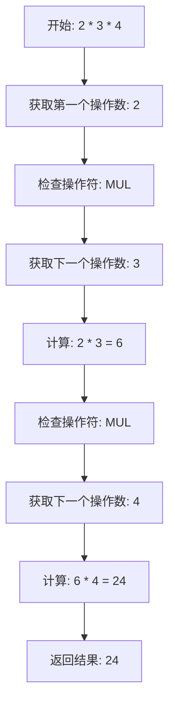
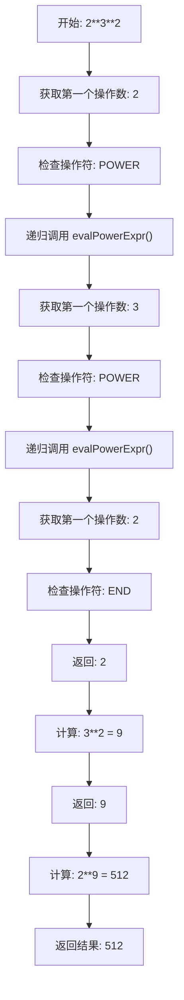

# 运算符结合性分析：左结合 vs 右结合

## 🎯 核心概念

### **左结合（Left Associative）**
- **计算顺序**：从左到右
- **实现方式**：while循环累积计算
- **示例**：`2 * 3 * 4 = (2 * 3) * 4 = 24`

### **右结合（Right Associative）**
- **计算顺序**：从右到左
- **实现方式**：递归调用处理
- **示例**：`2**3**2 = 2**(3**2) = 512`

## 🔍 我们计算器中的实现

### **优先级层次（从高到低）**

| 优先级 | 函数名 | 操作符 | 结合性 | 实现方式 |
|--------|--------|--------|--------|----------|
| **1** | `evalPrimaryExpr()` | `()` `-` 数字 | 无 | 直接处理 |
| **2** | `evalPowerExpr()` | `**` 指数 | 右结合 | 递归调用 |
| **3** | `evalMulDivExpr()` | `*` `/` 乘除 | 左结合 | while循环 |
| **4** | `evalAddSubExpr()` | `+` `-` 加减 | 左结合 | while循环 |

## 🚀 左结合实现：乘法运算

### **代码实现**
```typescript
function evalMulDivExpr(): number {
    debug("EVAL:MulDivExpr");

    let mulDivExprVal = evalPowerExpr();  // 获取第一个操作数
    while (token === TokenType.MUL || token === TokenType.DIV) {
        const opToken = token;            // 保存操作符
        getToken();                       // 跳过操作符
        const tempVal = evalPowerExpr();  // 获取下一个操作数
        // 累积计算
        if (opToken === TokenType.MUL) {
            mulDivExprVal *= tempVal;     // 左结合：累积计算
        } else if (opToken === TokenType.DIV) {
            if (tempVal === 0) {
                error("Divide zero");
            } else {
                mulDivExprVal = Math.floor(mulDivExprVal / tempVal);
            }
        }
    }
    return mulDivExprVal;
}
```

### **执行流程：`2 * 3 * 4`**
```
开始: 2 * 3 * 4
├── 获取第一个操作数: 2
├── 检查操作符: MUL
├── 获取第二个操作数: 3
├── 计算: 2 * 3 = 6
├── 检查操作符: MUL
├── 获取第三个操作数: 4
├── 计算: 6 * 4 = 24
└── 返回结果: 24
```

### **调试输出分析**
```
[Debug] EVAL:MulDivExpr
[Debug] EVAL:PowerExpr
[Debug] EVAL:PrimaryExpr      // 处理 2
[Debug] TOKEN:MUL
[Debug] TOKEN:NUMBER
[Debug] EVAL:PowerExpr
[Debug] EVAL:PrimaryExpr      // 处理 3
[Debug] TOKEN:MUL
[Debug] TOKEN:NUMBER
[Debug] EVAL:PowerExpr
[Debug] EVAL:PrimaryExpr      // 处理 4
[Debug] TOKEN:END
```

## 🎯 右结合实现：指数运算

### **代码实现**
```typescript
function evalPowerExpr(): number {
    debug("EVAL:PowerExpr");

    let powerExprVal = evalPrimaryExpr();
    while (token === TokenType.POWER) {
        getToken();
        const tempVal = evalPowerExpr();  // 递归调用自己！
        powerExprVal = Math.pow(powerExprVal, tempVal);
    }

    return powerExprVal;
}
```

### **执行流程：`2**3**2`**
```
第1次调用 evalPowerExpr():
├── 获取第一个操作数: 2
├── 检查操作符: POWER
├── 递归调用 evalPowerExpr() → 第2次调用
│   ├── 获取第一个操作数: 3
│   ├── 检查操作符: POWER
│   ├── 递归调用 evalPowerExpr() → 第3次调用
│   │   ├── 获取第一个操作数: 2
│   │   ├── 检查操作符: END
│   │   └── 返回: 2
│   ├── 计算: 3**2 = 9
│   └── 返回: 9
├── 计算: 2**9 = 512
└── 返回: 512
```

### **调试输出分析**
```
[Debug] EVAL:PowerExpr        // 第1次调用
[Debug] EVAL:PrimaryExpr      // 处理 2
[Debug] TOKEN:POWER           // 遇到 **
[Debug] TOKEN:NUMBER          // 处理 3
[Debug] EVAL:PowerExpr        // 第2次调用（递归）
[Debug] EVAL:PrimaryExpr      // 处理 3
[Debug] TOKEN:POWER           // 遇到 **
[Debug] TOKEN:NUMBER          // 处理 2
[Debug] EVAL:PowerExpr        // 第3次调用（递归）
[Debug] EVAL:PrimaryExpr      // 处理 2
[Debug] TOKEN:END             // 结束
```

## 🔧 关键区别对比

| 特性 | 左结合（乘法） | 右结合（指数） |
|------|----------------|----------------|
| **调用方式** | `evalPowerExpr()` | `evalPowerExpr()` |
| **调用目标** | 下一级优先级 | 自己（递归） |
| **计算顺序** | 从左到右 | 从右到左 |
| **实现方式** | while循环累积 | 递归调用 |
| **数学性质** | 满足结合律 | 不满足结合律 |

## 🧮 数学验证

### **左结合验证：乘法**
```
2 * 3 * 4
= (2 * 3) * 4    // 左结合
= 6 * 4
= 24
```

### **右结合验证：指数**
```
2**3**2
= 2**(3**2)      // 右结合
= 2**9
= 512
```

### **如果指数是左结合（错误）**
```
2**3**2
= (2**3)**2      // 左结合（错误）
= 8**2
= 64
```

## 🎯 为什么这样设计？

### **乘法：左结合**
- **数学性质**：乘法满足结合律 `(a * b) * c = a * (b * c)`
- **计算效率**：从左到右计算更直观
- **编程习惯**：符合大多数编程语言的标准

### **指数：右结合**
- **数学性质**：指数不满足结合律 `(a^b)^c ≠ a^(b^c)`
- **数学直觉**：`2^3^2` 通常理解为 `2^(3^2)`
- **编程标准**：Python、JavaScript等都采用右结合

## 🚀 实际测试结果

### **测试用例1：乘法（左结合）**
```bash
$ echo "2 * 3 * 4" | bun run index.ts
Evaluate result :)
24
```

### **测试用例2：指数（右结合）**
```bash
$ echo "2**3**2" | bun run index.ts
Evaluate result :)
512
```

### **测试用例3：混合优先级**
```bash
$ echo "1 + 2 * 3 ** 2" | bun run index.ts
Evaluate result :)
19
```

## 📊 执行流程图

### **左结合流程图**


### **右结合流程图**


## 🎯 总结

### **左结合实现**
- **关键**：while循环累积计算
- **特点**：从左到右处理
- **适用**：满足结合律的运算（加减乘除）

### **右结合实现**
- **关键**：递归调用自己
- **特点**：从右到左处理
- **适用**：不满足结合律的运算（指数）

### **我们的实现优势**
1. **符合标准**：与主流编程语言一致
2. **数学正确**：符合数学直觉
3. **代码清晰**：递归和循环分别处理不同结合性
4. **易于扩展**：添加新操作符时选择正确的结合性

这就是我们计算器中运算符结合性的完整实现！🎉
