# AST 结构图

基于 step1.txt 中的 AST 结构生成的 Mermaid 图表：

```mermaid
graph TD
    A[Program] --> B[FunctionDeclaration: change]
    A --> C[FunctionDeclaration: main]
    
    %% change 函数
    B --> B1[parameters: a, b]
    B --> B2[BlockStatement]
    
    B2 --> B2_1[VariableDeclaration: c = 5]
    B2 --> B2_2[VariableDeclaration: d = 2]
    B2 --> B2_3[VariableDeclaration: e = 0]
    B2 --> B2_4[IfStatement]
    B2 --> B2_5[ReturnStatement: e + 1]
    
    %% if 条件
    B2_4 --> B2_4_1[condition: a >= b]
    B2_4_1 --> B2_4_1_1[BinaryExpression: >=]
    B2_4_1_1 --> B2_4_1_1_1[Identifier: a]
    B2_4_1_1 --> B2_4_1_1_2[Identifier: b]
    
    %% then 分支
    B2_4 --> B2_4_2[thenBranch: BlockStatement]
    B2_4_2 --> B2_4_2_1[AssignmentStatement: e = a*b + c*d]
    B2_4_2_1 --> B2_4_2_1_1[BinaryExpression: +]
    B2_4_2_1_1 --> B2_4_2_1_1_1[BinaryExpression: *]
    B2_4_2_1_1_1 --> B2_4_2_1_1_1_1[Identifier: a]
    B2_4_2_1_1_1 --> B2_4_2_1_1_1_2[Identifier: b]
    B2_4_2_1_1 --> B2_4_2_1_1_2[BinaryExpression: *]
    B2_4_2_1_1_2 --> B2_4_2_1_1_2_1[Identifier: c]
    B2_4_2_1_1_2 --> B2_4_2_1_1_2_2[Identifier: d]
    
    %% else 分支
    B2_4 --> B2_4_3[elseBranch: BlockStatement]
    B2_4_3 --> B2_4_3_1[AssignmentStatement: e = a*b - c*d]
    B2_4_3_1 --> B2_4_3_1_1[BinaryExpression: -]
    B2_4_3_1_1 --> B2_4_3_1_1_1[BinaryExpression: *]
    B2_4_3_1_1_1 --> B2_4_3_1_1_1_1[Identifier: a]
    B2_4_3_1_1_1 --> B2_4_3_1_1_1_2[Identifier: b]
    B2_4_3_1_1 --> B2_4_3_1_1_2[BinaryExpression: *]
    B2_4_3_1_1_2 --> B2_4_3_1_1_2_1[Identifier: c]
    B2_4_3_1_1_2 --> B2_4_3_1_1_2_2[Identifier: d]
    B2_4_3 --> B2_4_3_2[EmptyStatement]
    
    %% return 语句
    B2_5 --> B2_5_1[BinaryExpression: +]
    B2_5_1 --> B2_5_1_1[Identifier: e]
    B2_5_1 --> B2_5_1_2[NumberLiteral: 1]
    
    %% main 函数
    C --> C1[parameters: empty]
    C --> C2[BlockStatement]
    
    C2 --> C2_1[VariableDeclaration: sum = 0]
    C2 --> C2_2[VariableDeclaration: count = 1]
    C2 --> C2_3[VariableDeclaration: maxCount = 10]
    C2 --> C2_4[WhileStatement]
    C2 --> C2_5[AssignmentStatement: sum = change]
    C2 --> C2_6[ExpressionStatement: print]
    C2 --> C2_7[ReturnStatement: 0]
    
    %% while 循环
    C2_4 --> C2_4_1[condition: count <= maxCount]
    C2_4_1 --> C2_4_1_1[BinaryExpression: <=]
    C2_4_1_1 --> C2_4_1_1_1[Identifier: count]
    C2_4_1_1 --> C2_4_1_1_2[Identifier: maxCount]
    
    C2_4 --> C2_4_2[body: BlockStatement]
    C2_4_2 --> C2_4_2_1[IfStatement]
    C2_4_2 --> C2_4_2_2[AssignmentStatement: count = count + 1]
    C2_4_2 --> C2_4_2_3[EmptyStatement]
    
    %% while 内部的 if
    C2_4_2_1 --> C2_4_2_1_1[condition: count > 5]
    C2_4_2_1_1 --> C2_4_2_1_1_1[BinaryExpression: >]
    C2_4_2_1_1_1 --> C2_4_2_1_1_1_1[Identifier: count]
    C2_4_2_1_1_1 --> C2_4_2_1_1_1_2[NumberLiteral: 5]
    
    %% then 分支 (count > 5)
    C2_4_2_1 --> C2_4_2_1_2[thenBranch: BlockStatement]
    C2_4_2_1_2 --> C2_4_2_1_2_1[AssignmentStatement: sum = sum + count*2]
    C2_4_2_1_2_1 --> C2_4_2_1_2_1_1[BinaryExpression: +]
    C2_4_2_1_2_1_1 --> C2_4_2_1_2_1_1_1[Identifier: sum]
    C2_4_2_1_2_1_1 --> C2_4_2_1_2_1_1_2[BinaryExpression: *]
    C2_4_2_1_2_1_1_2 --> C2_4_2_1_2_1_1_2_1[Identifier: count]
    C2_4_2_1_2_1_1_2 --> C2_4_2_1_2_1_1_2_2[NumberLiteral: 2]
    C2_4_2_1_2 --> C2_4_2_1_2_2[EmptyStatement]
    C2_4_2_1_2 --> C2_4_2_1_2_3[ExpressionStatement: print]
    C2_4_2_1_2_3 --> C2_4_2_1_2_3_1[FunctionCall: print]
    C2_4_2_1_2_3_1 --> C2_4_2_1_2_3_1_1[Identifier: sum]
    
    %% else 分支 (count <= 5)
    C2_4_2_1 --> C2_4_2_1_3[elseBranch: BlockStatement]
    C2_4_2_1_3 --> C2_4_2_1_3_1[AssignmentStatement: sum = sum + count]
    C2_4_2_1_3_1 --> C2_4_2_1_3_1_1[BinaryExpression: +]
    C2_4_2_1_3_1_1 --> C2_4_2_1_3_1_1_1[Identifier: sum]
    C2_4_2_1_3_1_1 --> C2_4_2_1_3_1_1_2[Identifier: count]
    C2_4_2_1_3 --> C2_4_2_1_3_2[EmptyStatement]
    C2_4_2_1_3 --> C2_4_2_1_3_3[ExpressionStatement: print]
    C2_4_2_1_3_3 --> C2_4_2_1_3_3_1[FunctionCall: print]
    C2_4_2_1_3_3_1 --> C2_4_2_1_3_3_1_1[Identifier: sum]
    
    %% count = count + 1
    C2_4_2_2 --> C2_4_2_2_1[BinaryExpression: +]
    C2_4_2_2_1 --> C2_4_2_2_1_1[Identifier: count]
    C2_4_2_2_1 --> C2_4_2_2_1_2[NumberLiteral: 1]
    
    %% sum = change(sum, maxCount)
    C2_5 --> C2_5_1[FunctionCall: change]
    C2_5_1 --> C2_5_1_1[Identifier: sum]
    C2_5_1 --> C2_5_1_2[Identifier: maxCount]
    
    %% print(sum)
    C2_6 --> C2_6_1[FunctionCall: print]
    C2_6_1 --> C2_6_1_1[Identifier: sum]
    
    %% return 0
    C2_7 --> C2_7_1[NumberLiteral: 0]
    
    %% 样式
    classDef function fill:#e1f5fe
    classDef statement fill:#f3e5f5
    classDef expression fill:#e8f5e8
    classDef literal fill:#fff3e0
    
    class B,C function
    class B2,C2,B2_4,C2_4_2,C2_4_2_1 statement
    class B2_4_1_1,B2_4_2_1_1,B2_5_1,C2_4_1_1,C2_4_2_1_1_1,C2_4_2_1_2_1_1,C2_4_2_1_3_1_1,C2_4_2_2_1 expression
    class B2_4_1_1_1_2,B2_5_1_2,C2_4_2_1_1_1_2,C2_4_2_1_2_1_1_2_2,C2_4_2_2_1_2,C2_7_1 literal
```

## AST 结构说明

### 主要组件：

1. **Program**: 根节点，包含两个函数声明
2. **FunctionDeclaration**: 
   - `change(int a, int b)`: 带参数的函数
   - `main()`: 主函数，无参数

### change 函数结构：
- 3个局部变量声明 (c, d, e)
- 1个 if-else 语句 (a >= b 条件)
- 1个 return 语句 (e + 1)

### main 函数结构：
- 3个局部变量声明 (sum, count, maxCount)
- 1个 while 循环 (count <= maxCount)
- 1个函数调用 (change(sum, maxCount))
- 1个 print 调用
- 1个 return 语句

### 嵌套结构：
- while 循环内部包含 if-else 语句
- if-else 语句内部包含赋值和 print 调用
- 表达式包含多层嵌套的二元运算

这个 AST 展示了复杂的控制流和表达式嵌套结构，是编译器前端处理的典型例子。
